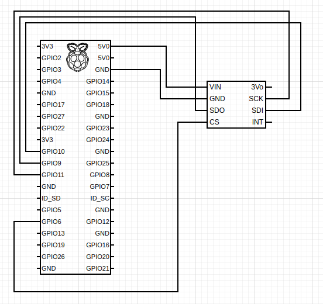

# Hardware for stork navigation

To get sensor data stork navigation is using BLE bluetooth technology. This is description of how to send data to stork navigation.

## Air pressure

Connect BMP-388 with RPi as on the scheme.

## Sending data to navigation

On RPi run script `python3 plane-instruments.py`. Pair your device with RPi bluetooth. Start stork navigation and in setting, under bluetooth, connect to RPi device.
